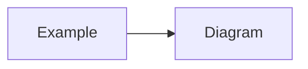

# Architecture Handoff: <feature-id>

## Problem Statement
<what problem are we solving>

## Scope
<in scope>

## Non-Goals
<explicitly out of scope>

## Existing-System Findings
<repo inspection results, current behavior, gaps>

## Proposed Design
<diagrams, flows, component/crate interactions>

## Affected Modules
| Module | Change |
|--------|--------|
| | |

## State Ownership
| State | Owner (slice/crate) | Notes |
|-------|---------------------|-------|
| | | |

## API and Contract Impact
<endpoints, request/response changes, breaking changes>

## Data Migration Impact
<schema changes, backfill, rollback>

## Risks and Mitigations
| Risk | Mitigation |
|------|------------|
| | |

## Acceptance Criteria
- AC-1: ...
- AC-2: ...

## Test Strategy
| AC | Test type | Description |
|----|-----------|-------------|
| AC-1 | | |

## ADR References
- ADR-NNNN: ... (or "None required")

## Mermaid Diagrams
<!-- Include flowchart, sequenceDiagram, or stateDiagram-v2 when design is non-trivial -->

## Implementation Agent Approval

> **Approved to proceed:** Yes | No
>
> **Approved by:** Architecture Agent
>
> **Date:** YYYY-MM-DD
>
> **Conditions:** <any conditions or "None">
