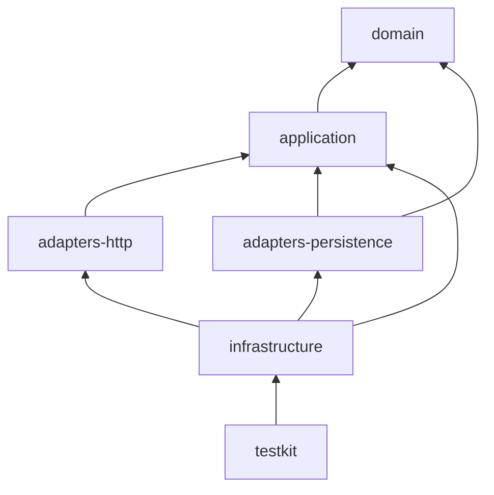
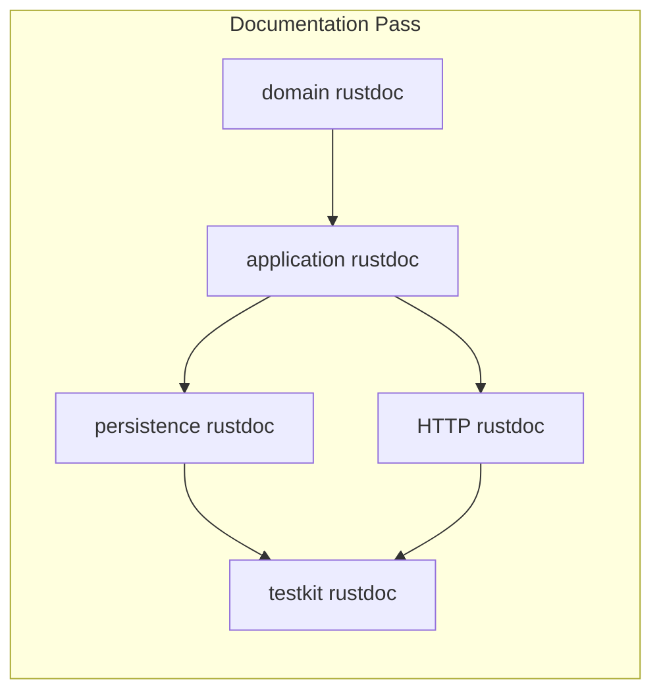

# Architecture Handoff: backend-rustdoc-documentation

## Problem Statement

The Rust backend has thin, inconsistent rustdoc. A senior engineer reviewing money movement, double-entry ledger behavior, idempotency, locking, retries, and crate boundaries cannot rely on in-code documentation. There is no `missing_docs` enforcement and no rustdoc examples for pure domain behavior.

## Scope

- Documentation-only pass for `apps/api/` Rust workspace crates:
  - `domain`, `application`, `contracts`, `adapters-http`, `adapters-persistence`, `infrastructure`, `testkit`, `migrations`
- Add/improve crate-level `//!`, module-level `//!`, and item-level `///` rustdoc
- Add compiling rustdoc examples for pure domain code where useful
- Enable documentation lints (`missing_docs`, `broken_intra_doc_links`, `bare_urls`) where practical
- Document financial integration tests with concise invariant comments
- Work-item reports under `docs/ai/work-items/backend-rustdoc-documentation/`

## Non-Goals

- No runtime behavior, business logic, schema, or public API contract changes
- No frontend (React Native) changes
- No new dependencies
- No ADR required unless a lint exception needs architectural rationale (prefer narrow `#[allow(missing_docs)]` with reason)
- No commits unless later authorized via Committer Agent

## Existing-System Findings

| Finding | Detail |
| ------- | ------ |
| Crate docs | Every crate has a one-line `//!`; insufficient depth for layer/deps/invariants |
| Domain | Public items have short `///`; **no module `//!`**; no `# Examples` |
| Application | Port traits and DTOs largely undocumented |
| Persistence | Executor module `//!` exists; private lock/retry helpers lightly documented |
| HTTP | Handlers have brief docs + utoipa; missing auth/header/status depth |
| Testkit | Stronger module docs; helpers need “bypass production?” warnings |
| Lints | No `#![warn(missing_docs)]` anywhere |
| Isolation level | Transfer executor uses **`ReadCommitted`** + `FOR UPDATE` row locks + advisory locks (must not claim SERIALIZABLE) |

Dependency direction (unchanged):

## Proposed Design

1. **Depth by risk**: Critical financial paths (money, ledger, idempotency, transfer service, Postgres executor, HTTP transfer/auth) get full invariant/concurrency/transaction docs. DTOs and generated entities get purposeful shorter docs or justified `allow(missing_docs)`.
2. **Honest guarantees**: Document implemented isolation (`ReadCommitted`), lock ordering (UUID-ordered `FOR UPDATE`), advisory idempotency locks, serialization retry (≤5 with jitter), insufficient-funds rollback + out-of-txn audit for decline.
3. **Lint strategy**:
   - Enable `#![warn(missing_docs)]` (+ rustdoc link/url lints) on `domain`, `application`, `contracts` at minimum
   - Enable on other crates where completing public surface is tractable; otherwise document exceptions
4. **Examples**: Compiling `cargo test --doc` examples on `Money`, `Currency`, ledger balancing, idempotency fingerprint helpers
5. **No behavior changes**: Comments and lint attributes only; compile-only fixes solely if required for valid rustdoc

## Affected Modules

| Module | Change |
| ------ | ------ |
| `crates/domain/src/*` | Crate/module/item docs + examples + lints |
| `crates/application/src/*` | Crate/module/item docs (ports, DTOs, services) + lints |
| `crates/contracts` | Expanded crate docs + lints |
| `crates/adapters-persistence/**` | Executor/mapper/repo/entity docs |
| `crates/adapters-http/**` | Handler/middleware/error/router docs |
| `crates/infrastructure/**` | Composition root, config, auth, telemetry, bins |
| `crates/testkit/**` + integration tests | Helper + invariant docs |
| `migrations/**` | Crate/module docs; allow on generated migration field noise if needed |

## State Ownership

| State | Owner | Notes |
| ----- | ----- | ----- |
| Money / ledger rules | `domain` | Pure; no I/O |
| Transfer orchestration | `application::TransferService` | Idempotency pre-check + feed publish |
| Transactional money movement | `adapters-persistence::PostgresTransferExecutor` | Locks, ledger, balances, idempotency store |
| HTTP contracts | `adapters-http` | Auth, headers, status mapping |
| Test DB isolation | `testkit` | Truncate/seed; may bypass production paths |

## API and Contract Impact

None — documentation only. OpenAPI schemas unchanged.

## Data Migration Impact

None.

## Risks and Mitigations

| Risk | Mitigation |
| ---- | ---------- |
| Docs claim stronger isolation/locking than code | Read executor carefully; document `ReadCommitted` honestly |
| `missing_docs` flood on SeaORM entities | Narrow `#[allow(missing_docs)]` with reason on generated models |
| Doc examples break compile | Prefer pure domain examples; mark infra setups `ignore` |
| Accidental logic edits | Diff review: comments/`#!`/`allow` only |

## Acceptance Criteria

- AC-1: Every backend crate has crate-level rustdoc covering purpose, layer, allowed/forbidden deps, responsibilities, invariants, neighbors
- AC-2: Every non-trivial module has module-level `//!`
- AC-3: All public items documented (or justified narrow allow)
- AC-4: Critical private financial/concurrency helpers documented
- AC-5: Money, ledger, transfer, idempotency, locking, retry, rollback, audit, HTTP, persistence, testkit covered per prompt checklist
- AC-6: Rustdoc examples for pure domain behavior
- AC-7: Doc lints enabled where practical
- AC-8: `cargo fmt --check`, `clippy -D warnings`, `cargo doc --workspace --all-features --no-deps`, `RUSTDOCFLAGS="-D warnings" cargo doc ...`, and `cargo test --doc --workspace` pass (or gaps documented)

## Test Strategy

| AC | Test type | Description |
| -- | --------- | ----------- |
| AC-6 | Doc tests | `cargo test --doc --workspace` |
| AC-7–8 | Tooling | fmt, clippy, rustdoc with `-D warnings` |
| AC-5 | Manual audit | Checklist against critical files |

## ADR References

- ADR-002: Hexagonal Rust backend (existing — no new ADR for docs-only)
- Docs must align with `docs/architecture/rust-layering.md`

## Mermaid Diagrams

## Implementation Agent Approval

> **Approved to proceed:** Yes
>
> **Approved by:** Architecture Agent
>
> **Date:** 2026-07-08
>
> **Conditions:** Documentation-only; no behavior/schema/API changes; document isolation level and lock/retry behavior accurately; enable `missing_docs` on domain/application/contracts at minimum; record any lint exceptions with rationale in `02-implementation.md`.
