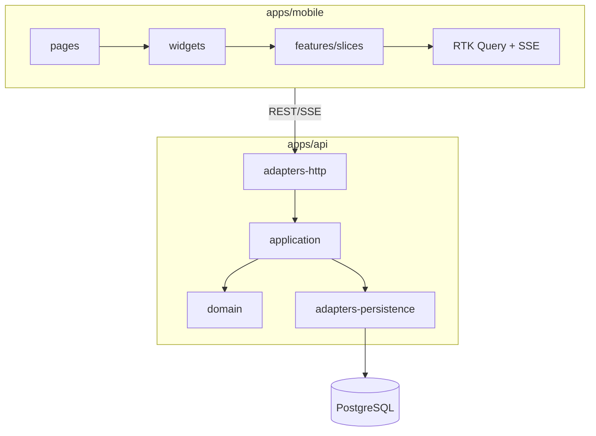
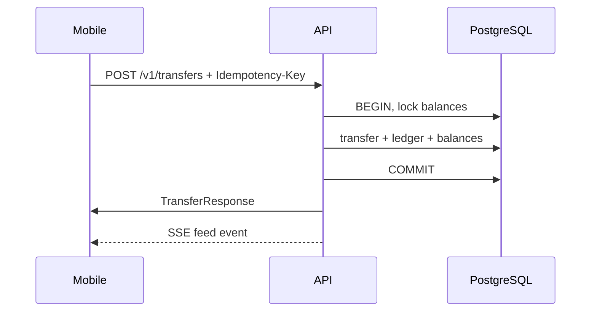

# Architecture Handoff: initial-platform-delivery

## Problem Statement

Deliver a Venmo-like money transfer app with login, P2P transfers, balance tracking, and a live global feed. Money integrity under concurrency and client retries is non-negotiable.

## Scope

- React Native mobile app (Expo) with Redux Toolkit + RTK Query
- Rust API (Axum) with layered hexagonal architecture
- PostgreSQL with double-entry ledger, idempotency, row-level locking
- SSE real-time feed
- Monorepo tooling (pnpm, Turbo, Cargo workspace)
- CI/CD workflows, observability stack, documentation, AI governance pipeline
- Mandatory concurrency and idempotency integration tests

## Non-Goals

- Third-party OAuth / payment processors
- Multi-currency FX
- Production deployment automation (K8s/Terraform)
- Horizontal scaling of SSE broadcast
- Refresh token rotation

## Existing-System Findings

Greenfield repository. Governance bootstrapped in `context.md`, `AGENTS.md`, `.ai/` before implementation.

## Proposed Design

## Affected Modules

| Module                                 | Change                   |
| -------------------------------------- | ------------------------ |
| `apps/mobile`                          | Full app scaffold        |
| `apps/api/crates/*`                    | Full API workspace       |
| `packages/contracts`, `packages/money` | Shared TS packages       |
| `infra/`, `docker-compose.yml`         | Postgres + observability |
| `docs/`, `.github/workflows/`          | Documentation and CI     |
| `.ai/`, `.cursor/rules/`               | Governance               |

## State Ownership

| State           | Owner               | Notes                             |
| --------------- | ------------------- | --------------------------------- |
| Auth session    | `authSlice`         | SecureStore via listeners         |
| Transfer form   | `transferFormSlice` | Includes idempotency key          |
| Server data     | RTK Query           | Balance, feed, users              |
| Balances/ledger | PostgreSQL          | Materialized + append-only ledger |

## API and Contract Impact

New API v1 surface documented in `docs/api/openapi.md`. Swagger at `/api-docs`.

## Data Migration Impact

Initial migration `m20250707_000001_create_initial_schema` creates users, accounts, balances, transfers, ledger, idempotency, audit tables.

## Risks and Mitigations

| Risk                      | Mitigation                              |
| ------------------------- | --------------------------------------- |
| Race on concurrent debits | `FOR UPDATE` + retry + CHECK constraint |
| Double-charge on retry    | Idempotency keys per user               |
| SSE scale limits          | Documented trade-off; ADR-006           |
| Float money bugs          | ADR-0001 integer minor units            |

## Acceptance Criteria

- AC-1: Users log in with username/password and receive JWT
- AC-2: Users search recipients and send money; balances update correctly
- AC-3: Global feed updates in real time without manual refresh
- AC-4: 100 concurrent transfers test passes (no negative balance, conservation)
- AC-5: Duplicate idempotency key does not double-charge
- AC-6: README and architecture docs enable local setup
- AC-7: CI runs lint, test, format for frontend and backend
- AC-8: All pipeline artifacts exist for this work item

## Test Strategy

| AC   | Test type                 | Description                      |
| ---- | ------------------------- | -------------------------------- |
| AC-1 | Integration + mobile unit | Login API + authSlice tests      |
| AC-2 | Integration + manual      | Transfer API + transferFormSlice |
| AC-3 | Integration + manual      | SSE stream + getFeed cache       |
| AC-4 | Integration               | `transfer_concurrency_test.rs`   |
| AC-5 | Integration               | `transfer_idempotency_test.rs`   |
| AC-6 | Manual                    | Follow README quick start        |
| AC-7 | CI                        | GitHub Actions workflows         |
| AC-8 | Doc review                | This work item folder            |

## ADR References

- ADR-0001: Integer Money Representation
- ADR-001: Monorepo Tooling
- ADR-002: Hexagonal Rust Backend
- ADR-003: JWT Authentication
- ADR-004: Transfer Idempotency
- ADR-005: Double-Entry Ledger
- ADR-006: SSE Global Feed
- ADR-007: Redux Mobile State
- ADR-008: PostgreSQL Concurrency
- ADR-009: Observability Stack

## Mermaid: Transfer Sequence

## Implementation Agent Approval

> **Approved to proceed:** Yes
>
> **Approved by:** Architecture Agent
>
> **Date:** 2025-07-07
>
> **Conditions:** None
