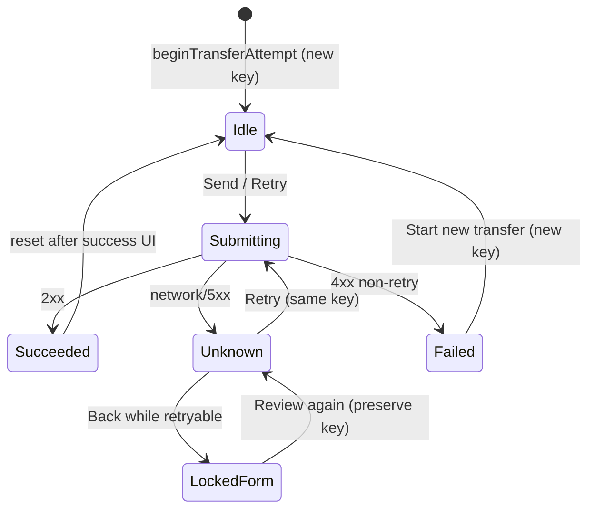
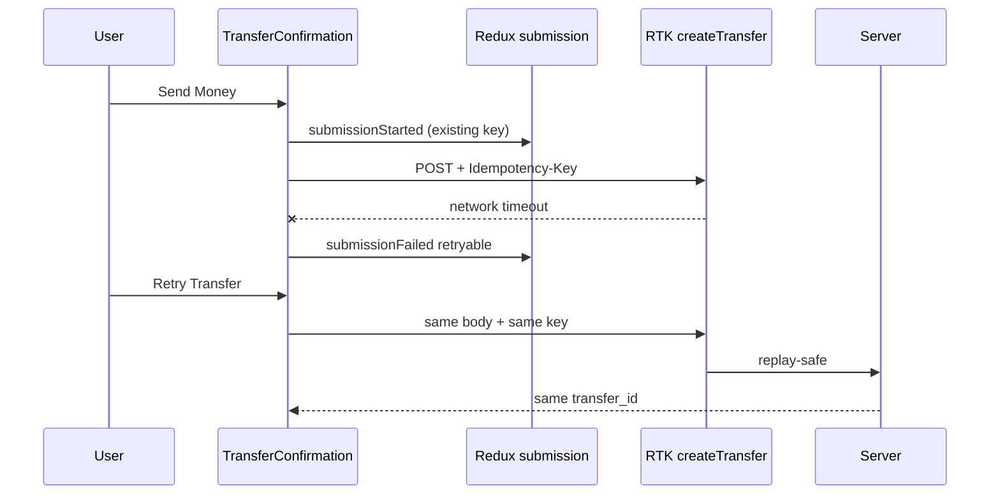

# Architecture Handoff: mobile-e2e-visual-quality-hardening

## Problem Statement

The React Native client has unit/component coverage for money math and parts of the transfer wizard, but lacks device E2E proof, has idempotency lifecycle holes (Back→Review key rotation under unknown outcome), missing global 401 logout, incomplete SSE reconnect/`Last-Event-ID`, no `testID`s for automation, and insufficient visual/accessibility polish for a trustworthy money app.

## Scope

- Harden transfer idempotency lifecycle (preserve key across retry; rotate only for new attempts)
- Wire 401 → clear credentials + RTK cache reset + login
- Improve SSE: buffer incomplete lines, reconnect with `Last-Event-ID`, dedupe
- Add Maestro E2E suite under `apps/mobile/e2e/` for required screen flows
- Add `testID`s / strengthen a11y labels without degrading UX
- Visual polish: confirmation finality warning, success state, clearer retry/conflict UI
- Expand unit/component/RTK Query tests for transfer, errors, cache invalidation
- Root scripts: `mobile:e2e`, `mobile:e2e:ios`, `mobile:e2e:android`, `mobile:e2e:record`
- Document runbook for mobile E2E with seeded alice/bob/charlie
- Pipeline artifacts through Documentation → QA → Review (Commit only when authorized)

## Non-Goals

- Multi-device concurrent E2E (two simulators) for live feed — covered by unit/integration with SSE mocks + single-device transfer→feed assertion
- Android emulator E2E if no emulator is available (document skip with reason)
- Persist idempotency keys in SecureStore (ADR-012 rejected for MVP)
- New backend financial routes or idempotency bypasses
- Ledger screen UI (endpoint exists; out of scope unless needed for tests)

## Existing-System Findings

| Area             | Finding                                                                               |
| ---------------- | ------------------------------------------------------------------------------------- |
| RTK Query        | `createTransfer` already sends `Idempotency-Key` + Bearer                             |
| Submission slice | Key generated on Review via `beginTransferAttempt`                                    |
| Gap              | Back from confirm + Review regenerates key → double-charge risk after unknown outcome |
| Gap              | 401 mapped in `transferErrors` but never clears auth                                  |
| Gap              | SSE no reconnect / no `Last-Event-ID`; chunk split fragile                            |
| Gap              | Zero `testID`s; no Maestro/Detox                                                      |
| Gap              | No dedicated success confirmation UI; wizard resets immediately                       |
| Gap              | Recipient search may include self if API returns current user                         |
| Clean            | No `useState` / Context / fetch in UI layers                                          |
| Seeds            | alice/bob/charlie / `password123` via `make db-seed`                                  |
| Runtime          | iPhone 16 Pro simulator booted; API may need restart; Postgres healthy                |

## Proposed Design

### Idempotency lifecycle (amend ADR-012 behavior)

Rules:

1. `beginTransferAttempt` only when `idempotencyKey === null` OR after explicit `resetSubmission` / success completion.
2. Navigating Back from confirm while `unknown_outcome` keeps the key; amount/description edits are blocked or cancel the attempt with an explicit “Cancel and start new transfer” action that resets the key.
3. Retry always reuses Redux `idempotencyKey` + identical body.
4. 409 → non-retryable; force new attempt after reset.

### Auth 401

Custom `baseQueryWithAuth` wraps `fetchBaseQuery`: on `401` (except login), dispatch `clearCredentials`, `resetSubmission`, `resetForm`, `baseApi.util.resetApiState()`.

### SSE

- Accumulate incomplete line buffer across XHR `onprogress` chunks
- Track last seen event id; reconnect with `Last-Event-ID` + exponential backoff while cache entry alive
- Keep transfer_id dedupe

### E2E

Maestro (least disruptive for Expo): YAML flows in `apps/mobile/e2e/flows/`, artifacts in `screenshots/` + `reports/`.

### testID convention

Stable ids: `login-username`, `login-password`, `login-submit`, `home-balance`, `home-logout`, `feed-list`, `transfer-search`, `transfer-amount`, `transfer-review`, `transfer-confirm`, `transfer-success`.

## Affected Modules

| Module                                        | Change                                       |
| --------------------------------------------- | -------------------------------------------- |
| `transferSubmissionSlice`                     | Preserve key; cancel/new-attempt actions     |
| `TransferAmountForm` / `TransferConfirmation` | Key rules, success UI, lock edits, testIDs   |
| `baseApi.ts`                                  | 401 wrapper; SSE reconnect + Last-Event-ID   |
| `sse.ts`                                      | Incomplete-line buffer; optional lastEventId |
| `RecipientSearch`                             | Filter self; testIDs                         |
| UI atoms/molecules                            | testID passthrough; a11y on feed cards       |
| `money.ts`                                    | Integer-safe amount validation               |
| `apps/mobile/e2e/**`                          | Maestro flows + reports                      |
| Root `package.json` / Makefile                | E2E scripts                                  |
| ADR-012 / ADR-013                             | Lifecycle amend + Maestro choice             |
| Listener / logout                             | Cache reset on logout                        |

## State Ownership

| State                       | Owner                       | Notes                        |
| --------------------------- | --------------------------- | ---------------------------- |
| Auth token / user           | `auth`                      | SecureStore via listeners    |
| Login fields / banners      | `ui`                        |                              |
| Wizard fields / step        | `transferForm`              |                              |
| Idempotency + submit status | `transferSubmission`        |                              |
| Server cache                | RTK Query `api`             | Balance/Feed/Users/Transfers |
| SSE connection              | `getFeed.onCacheEntryAdded` | Not Redux                    |

## API and Contract Impact

None breaking. Client begins sending `Last-Event-ID` (server already supports per ADR-006).

## Data Migration Impact

None. Use existing seed users; document `make db-seed` before E2E. Optional Makefile `mobile-e2e` target.

## Risks and Mitigations

| Risk                                      | Mitigation                                                                          |
| ----------------------------------------- | ----------------------------------------------------------------------------------- |
| Maestro not installed                     | Install via brew/curl; document; fail CI gracefully locally                         |
| App not Expo-dev-client named for Maestro | Use Expo app id / bundle id from `app.json`                                         |
| Seed balances drift after transfers       | Document reset (recreate volume) or fund via system; prefer bob→alice small amounts |
| Double-charge regression                  | Unit + confirm component tests for key preserve                                     |
| Flaky SSE reconnect                       | Unit tests with mocked XHR; bounded backoff                                         |

## Acceptance Criteria

- AC-1: App launches on iOS simulator; login screen visible
- AC-2: Invalid login shows generic error; stays unauthenticated
- AC-3: Seeded login reaches home with balance + feed + send affordance
- AC-4: Auth restores after relaunch when token valid
- AC-5: Recipient search works; excludes self; empty/error states handled
- AC-6: Amount validation disables submit for invalid inputs (no float money math)
- AC-7: Successful transfer shows confirmation details, sends Idempotency-Key, updates balance/feed
- AC-8: Double-tap does not create two mutations with different keys
- AC-9: Unknown outcome retry reuses same Idempotency-Key
- AC-10: Insufficient funds and 409 conflict show clear non-retry / guidance UI
- AC-11: 401 clears session and returns to login
- AC-12: Feed SSE reconnect does not duplicate items; cleanup on unmount
- AC-13: Logout clears token, cache, protected UI
- AC-14: Maestro flows cover critical paths with artifacts
- AC-15: Lint, typecheck, tests, coverage, build pass for mobile

## Test Strategy

| AC           | Test type        | Description                                             |
| ------------ | ---------------- | ------------------------------------------------------- |
| AC-6–10      | Unit / component | submission slice, TransferConfirmation, transferErrors  |
| AC-7,9,11,12 | RTK Query        | createTransfer headers, retry key, 401 baseQuery, SSE   |
| AC-1–14      | Maestro E2E      | flows under `e2e/flows/` when simulator + API available |
| AC-15        | CI gates         | pnpm lint/typecheck/test; make api-test as needed       |

## ADR References

- ADR-012: Mobile transfer idempotency lifecycle (amend preserve-on-back)
- ADR-006: SSE global feed (client Last-Event-ID + reconnect)
- ADR-007: Redux mobile state
- ADR-013: Maestro for Expo mobile E2E (new)
- ADR-004: Transfer idempotency (server)

## Mermaid Diagrams

## Implementation Agent Approval

> **Approved to proceed:** Yes
>
> **Approved by:** Architecture Agent
>
> **Date:** 2026-07-08
>
> **Conditions:** Follow ADR-012 amend for key preservation; no production auth/idempotency bypasses; E2E must record real command evidence in QA report; pipeline artifacts named per repo (`03-documentation.md`, `04-qa-report.md`, `05-code-review.md`, `06-commit-report.md`).
