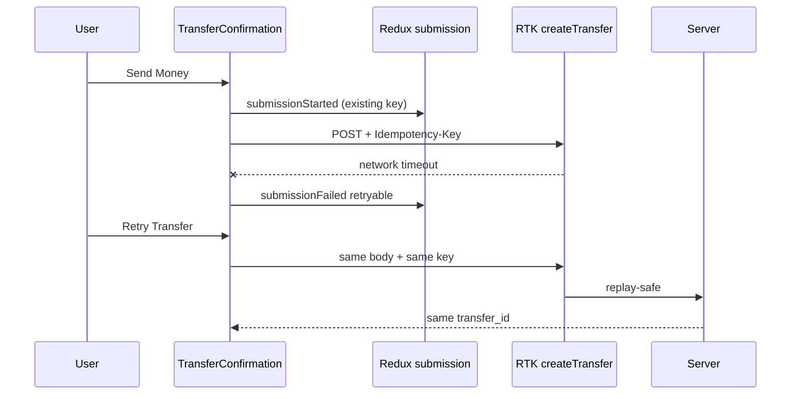
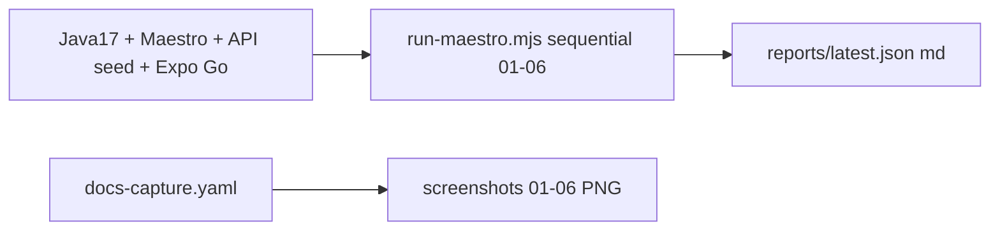

# Documentation Handoff: mobile-e2e-visual-quality-hardening

## Outcome

**PASS**

## Summary

Documented mobile E2E (Maestro) ops + curated flow screenshots, amended ADR-012/013 usage notes, updated runbook and root README, and recorded Mermaid for idempotency retry and Maestro run sequence. JSDoc/`///` style comments remain on new public mobile/money helpers and runner symbols.

## JSDoc Coverage

| File                                             | Symbol                                        | Documented | Notes                      |
| ------------------------------------------------ | --------------------------------------------- | ---------- | -------------------------- |
| `apps/mobile/e2e/run-maestro.mjs`                | `parseArgs`, `runOneFlow`, `listFlowFiles`, … | ✓          | JSDoc typedefs + functions |
| `apps/mobile/src/services/baseApi.ts`            | `baseQueryWithAuth`                           | ✓          | 401 logout behavior        |
| `apps/mobile/src/services/sse.ts`                | `parseSseBuffer`, `subscribeFeedSse`          | ✓          | buffer + reconnect         |
| `apps/mobile/src/features/transfer-submission/*` | selectors / actions                           | ✓          | locked attempt helpers     |
| `packages/money/src/index.ts`                    | `supportsFormatToParts`                       | ✓          | Hermes guard (internal)    |

### Exports Without JSDoc (must be empty for PASS)

None for this work item’s new public surfaces.

## Mermaid Diagrams

| Diagram           | Location                         | Type            | Describes                                  |
| ----------------- | -------------------------------- | --------------- | ------------------------------------------ |
| Idempotency retry | this file + `01-architecture.md` | sequenceDiagram | Same key on Retry after unknown outcome    |
| Maestro suite     | this file                        | flowchart       | Prerequisites → sequential flows → reports |

### Diagram Sources

## Module READMEs Created/Updated

| Path                                    | Summary                                                    |
| --------------------------------------- | ---------------------------------------------------------- |
| `apps/mobile/e2e/README.md`             | Prerequisites, flows, sequential runner, tabs, screenshots |
| `docs/operations/runbook.md`            | Mobile E2E (Maestro) section                               |
| `README.md`                             | Mobile E2E command + section                               |
| `docs/ai/adr/013-maestro-mobile-e2e.md` | Sequential runner + docs-capture exclusion                 |
| `docs/ai/adr/README.md`                 | Index ADR-012 / ADR-013                                    |

## Flow documentation screenshots

| Asset                                                   | Flow               |
| ------------------------------------------------------- | ------------------ |
| `apps/mobile/e2e/screenshots/01-login-screen.png`       | Login              |
| `apps/mobile/e2e/screenshots/02-home-balance-feed.png`  | Home               |
| `apps/mobile/e2e/screenshots/03-recipient-search.png`   | Recipient search   |
| `apps/mobile/e2e/screenshots/04-transfer-confirm.png`   | Confirm            |
| `apps/mobile/e2e/screenshots/05-transfer-success.png`   | Success            |
| `apps/mobile/e2e/screenshots/06-insufficient-funds.png` | Insufficient funds |

Evidence: `apps/mobile/e2e/reports/docs-capture.md` (capture PASS 2026-07-08).

## Tooling Verification

| Command                                    | Exit Code | Summary                              |
| ------------------------------------------ | --------- | ------------------------------------ |
| `pnpm --filter @ficus/mobile lint`         | 0         | ESLint + JSDoc                       |
| `pnpm exec prettier --check` (owned paths) | 0         | After write                          |
| Full `pnpm format:check`                   | see QA    | May fail on unrelated work-item docs |

## Documentation Decisions

- Curated PNGs are committed under `e2e/screenshots/`; ephemeral suite logs are gitignored.
- Expo Go tab taps document accessibility labels, not unsupported `tabBarTestID`.
- `docs-capture.yaml` stays in-repo for regenerating screenshots but is excluded from the suite runner.

## Known Gaps

- Android emulator E2E not re-proven in this wrap-up (iOS evidence only).
- Auth restore-after-relaunch (AC-4) relies on existing SecureStore behavior + unit coverage; no dedicated Maestro relaunch flow.

## QA Entry Criteria

- [x] All exported symbols documented per policy (this change set)
- [x] Mermaid diagrams match implementation
- [x] Lint and format:check pass on owned files
- [x] No stale Maestro config path (`e2e/config.yaml`, not `flows/config.yaml`)

## Documenter Sign-Off

> **Agent:** Documenter Agent
>
> **Date:** 2026-07-08
