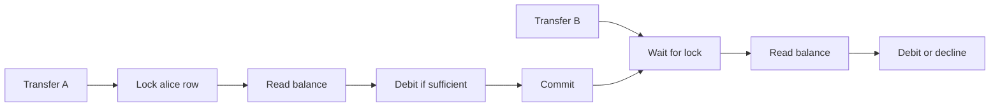

# Concurrency Control

How Ficus prevents race conditions when many transfers hit the same account simultaneously.

## Threat Model

| Scenario                                    | Risk without control            |
| ------------------------------------------- | ------------------------------- |
| 100 parallel debits from one funded account | Overdraft, negative balance     |
| Concurrent credit + debit                   | Lost update on balance row      |
| Serialization failure (PostgreSQL 40001)    | Intermittent 500s without retry |

## Strategy

1. **Pessimistic row locks** — `SELECT … FOR UPDATE` on sender and recipient `account_balances` rows inside a transaction.
2. **Ordered locking** — accounts locked in deterministic UUID order when both rows are needed (prevents deadlocks).
3. **CHECK constraint** — `balance_minor >= 0` on `account_balances` as a database backstop.
4. **Serialization retry** — up to 5 attempts with jittered backoff on retryable errors (serialization failure, deadlock).

## Isolation Level

Transactions use PostgreSQL default **READ COMMITTED** with explicit row locks. Serializable isolation is not required because `FOR UPDATE` serializes balance mutations per account.

## Declined vs Failed

| Outcome       | Meaning                                                                     |
| ------------- | --------------------------------------------------------------------------- |
| `COMPLETED`   | Funds moved; ledger written                                                 |
| `DECLINED`    | Insufficient funds or business rule (e.g., self-transfer); no ledger impact |
| Error / retry | Transient DB conflict; client may retry with same idempotency key           |

## Mandatory Concurrency Test

`transfer_concurrency_test.rs` fires **100 concurrent** $1.00 transfers from an account funded with $50.00:

| Assertion                       | Expected                    |
| ------------------------------- | --------------------------- |
| No negative balances            | Pass                        |
| Money conserved                 | Pass                        |
| Only fundable transfers succeed | ~50 completed, ~50 declined |
| No orphan ledger entries        | Pass                        |
| Unique idempotency per request  | Pass                        |
| Sender final balance correct    | Pass                        |

## Performance Considerations

Hot accounts (many concurrent senders to one recipient) serialize on the recipient balance row. For this product scope, simplicity and correctness outweigh throughput optimization.

Future options (require new ADRs):

- Queue per account
- Optimistic concurrency with version column
- Partitioned ledger with async balance projection

## Related ADRs

- [ADR-008](../ai/adr/008-postgresql-concurrency.md)
