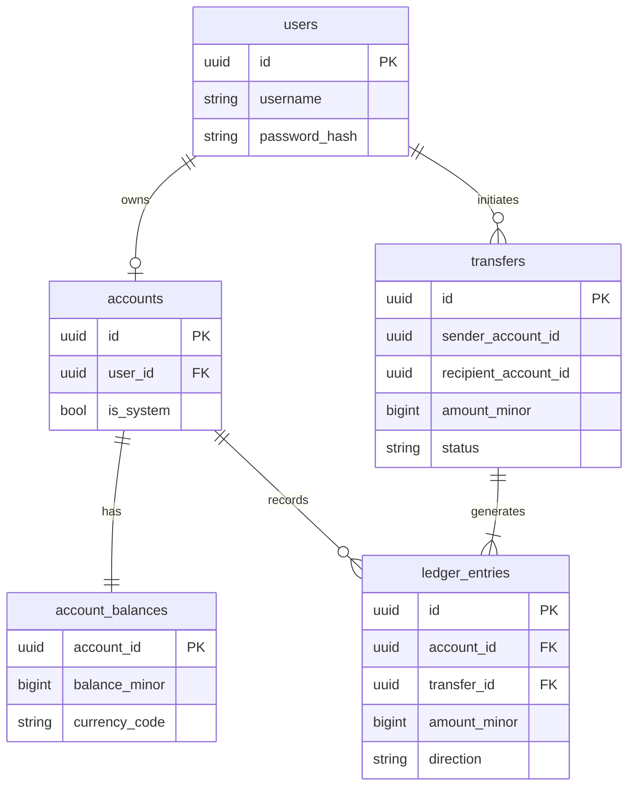
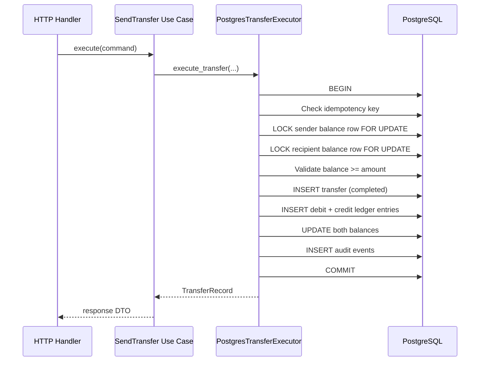

# Financial Ledger

How Ficus represents money, records transfers, and keeps balances auditable.

## Principles

1. **Integer minor units only** — all amounts are `i64` cents (see [ADR-0001](../ai/adr/0001-integer-money-representation.md)).
2. **Double-entry** — every completed transfer creates matching debit and credit ledger entries.
3. **Append-only ledger** — `ledger_entries` rows are never updated or deleted.
4. **Materialized balance** — `account_balances.balance_minor` is updated atomically with ledger writes for fast reads.
5. **Reconciliation** — sum of signed ledger entries per account must equal materialized balance (verified in tests).

## Data Model

## Transfer Lifecycle

## Signed Ledger Convention

| Direction | Effect on account balance         |
| --------- | --------------------------------- |
| `credit`  | Increases balance (+amount_minor) |
| `debit`   | Decreases balance (−amount_minor) |

Domain logic in `ficus_domain::ledger::build_transfer_entries` produces the debit/credit pair. Persistence writes both rows in the same transaction as balance updates.

## System Account

A well-known system account (`00000000-0000-0000-0000-000000000001`) funds initial user balances during seeding. System debits reduce the system balance; user credits increase user balances. Conservation tests include the system account in totals.

## Invariants

| ID  | Invariant                                                                                 |
| --- | ----------------------------------------------------------------------------------------- |
| L-1 | No account balance may go below zero (DB check constraint + domain validation)            |
| L-2 | Completed transfer always has exactly two ledger entries (debit sender, credit recipient) |
| L-3 | Sum of signed ledger entries per account equals `account_balances.balance_minor`          |
| L-4 | Total money in the system is conserved across completed transfers                         |
| L-5 | Declined or failed transfers leave no partial ledger entries                              |

## Implementation References

| Component            | Crate / path                                                                      |
| -------------------- | --------------------------------------------------------------------------------- |
| `Money` newtype      | `apps/api/crates/domain/src/money.rs`                                             |
| Ledger entry builder | `apps/api/crates/domain/src/ledger.rs`                                            |
| Atomic executor      | `apps/api/crates/adapters-persistence/src/executor/postgres_transfer_executor.rs` |
| Reconciliation test  | `apps/api/crates/testkit/tests/ledger_balance_reconciliation_test.rs`             |

## Related ADRs

- [ADR-0001](../ai/adr/0001-integer-money-representation.md) — integer money
- [ADR-005](../ai/adr/005-double-entry-ledger.md) — double-entry decision
- [ADR-008](../ai/adr/008-postgresql-concurrency.md) — row locking strategy
