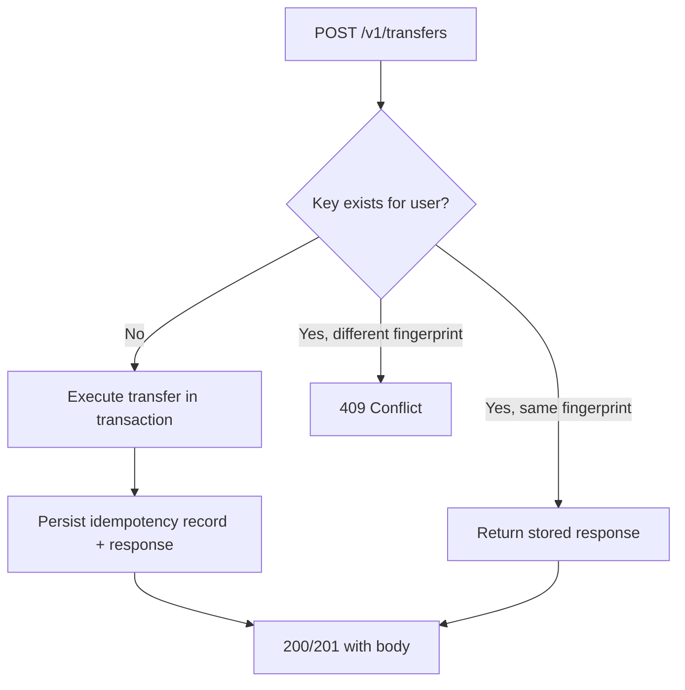

# Idempotency

Retry-safe transfer creation for clients that may resubmit after timeouts or network failures.

## Problem

Mobile clients and proxies can deliver the same `POST /v1/transfers` more than once. Without idempotency, duplicate requests would double-charge the sender.

## Solution

Clients send an **`Idempotency-Key`** header (UUID recommended) on every transfer request. The server stores the outcome keyed by `(user_id, idempotency_key)` and returns the cached response on replay.



## Request Fingerprint

The server computes a canonical fingerprint from:

- `recipient_username`
- `amount_minor`
- `currency`
- `description` (normalized)

If a client reuses an idempotency key with **different** transfer parameters, the API returns **409 Conflict** (`IdempotencyKeyConflict`). This prevents accidental key reuse across distinct operations.

## Storage

Table `idempotency_requests`:

| Column                        | Purpose                      |
| ----------------------------- | ---------------------------- |
| `user_id` + `idempotency_key` | Unique composite key         |
| `request_fingerprint`         | Detect parameter mismatch    |
| `response_status`             | HTTP status to replay        |
| `response_body`               | Serialized JSON response     |
| `transfer_id`                 | Link to completed transfer   |
| `expires_at`                  | TTL for cleanup (future job) |

Records are written in the **same database transaction** as the transfer so partial states cannot occur.

## Client Guidance

1. Generate a new UUID per user-initiated transfer attempt.
2. Reuse the **same** key when retrying after timeout (do not generate a new key on retry).
3. Store the key locally until a definitive success or non-retryable error.
4. RTK Query mutations should accept an idempotency key from the transfer form slice.

### Example

```http
POST /v1/transfers HTTP/1.1
Authorization: Bearer <token>
Idempotency-Key: 550e8400-e29b-41d4-a716-446655440000
Content-Type: application/json

{
  "recipient_username": "bob",
  "amount_minor": "1000",
  "currency": "USD",
  "description": "Coffee"
}
```

## Test Coverage

`apps/api/crates/testkit/tests/transfer_idempotency_test.rs` verifies:

- Duplicate submission returns the same `transfer_id`
- Sender balance debited only once
- Conflicting fingerprint rejected

## Related ADRs

- [ADR-004](../ai/adr/004-transfer-idempotency.md)
