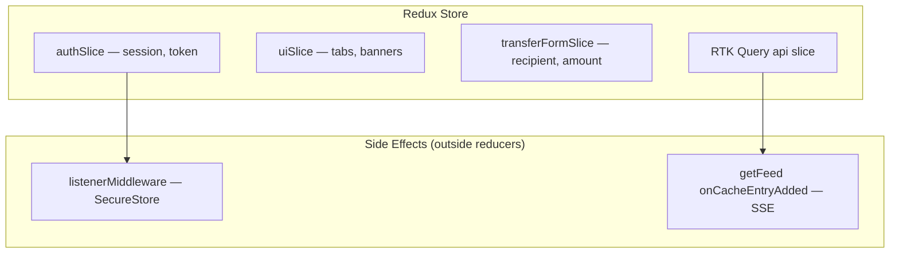

# Mobile State Management

Redux Toolkit–centric state architecture for the React Native client.

## Rules (Enforced)

| Allowed                              | Prohibited for app state       |
| ------------------------------------ | ------------------------------ |
| Redux Toolkit slices                 | `useState`, `useReducer`       |
| RTK Query for API                    | Direct `fetch` / `axios`       |
| Listener middleware for side effects | `createContext` / `useContext` |
| Pure reducers                        | Side effects inside reducers   |

ESLint architectural rules in `@ficus/eslint-config` enforce these constraints.

## Store Structure



## Slice Responsibilities

| Slice                  | State owned                                                           |
| ---------------------- | --------------------------------------------------------------------- |
| `authSlice`            | `accessToken`, `userId`, `username`, rehydration status               |
| `uiSlice`              | Active tab, global error banner text                                  |
| `transferFormSlice`    | Recipient selection, amount input, idempotency key, submission status |
| `baseApi` / `ficusApi` | Server data cache (balance, feed, users, transfers)                   |

## Atomic Design Layout

```
apps/mobile/src/
  app/           # Navigation, providers
  pages/         # Route screens
  widgets/       # Composed feature blocks
  features/      # Slices + feature logic
  entities/      # Domain types
  shared/ui/     # atoms → molecules → organisms → templates
  services/      # RTK Query, SSE, config
  store/         # configureStore, hooks, listeners
```

## Auth Persistence

`listenerMiddleware` syncs credentials to **Expo SecureStore** on `setCredentials` and clears on `logout`. `bootstrapAuth()` dispatches `rehydrateStarted` at app launch.

## API Integration

All HTTP via RTK Query (`apps/mobile/src/services/baseApi.ts`):

- `prepareHeaders` injects `Authorization: Bearer`
- Tag-based cache invalidation (`Balance`, `Feed`, `Transfers`)
- Transfer mutation should pass `Idempotency-Key` header (from form slice)

## Money Display

Use `@ficus/money` helpers — format minor units for display; never use JavaScript floating-point arithmetic on raw amounts.

## Testing

Slice unit tests with Vitest:

- `authSlice.test.ts`
- `transferFormSlice.test.ts`
- `uiSlice.test.ts`
- `money.test.ts`

## Related ADRs

- [ADR-007](../ai/adr/007-redux-mobile-state.md)
