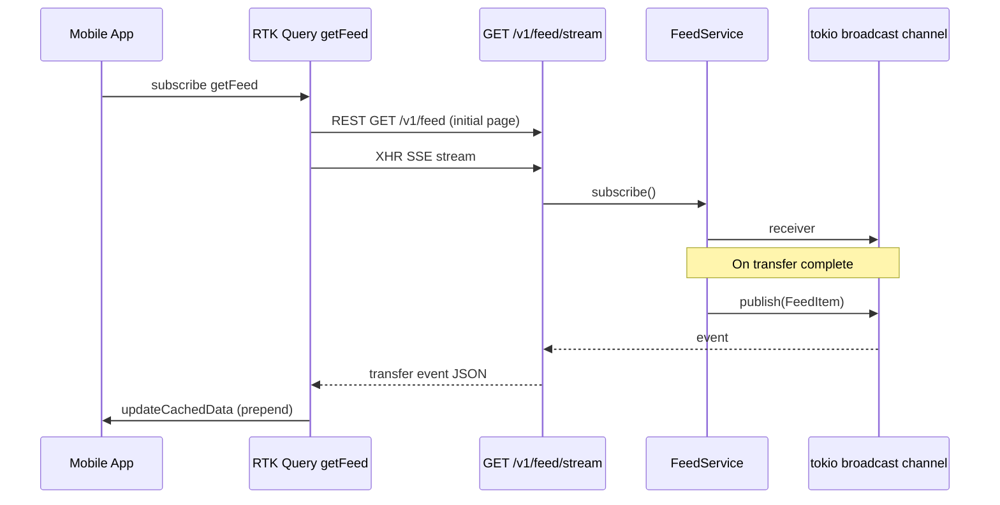

# Real-Time Feed

Live global transaction feed without manual refresh.

## Requirements

- All users see completed transfers across the system
- New items appear automatically on connected clients
- Supports reconnection with gap fill via `Last-Event-ID`

## Architecture



## API Endpoints

| Endpoint              | Purpose                                  |
| --------------------- | ---------------------------------------- |
| `GET /v1/feed`        | Paginated historical feed (cursor-based) |
| `GET /v1/feed/stream` | SSE stream of new transfers              |

### SSE Event Format

```
id: <transfer_uuid>
event: transfer
data: {"transfer_id":"...","sender_username":"alice",...}

```

Keep-alive comments sent every 15 seconds (`: keep-alive`).

### Reconnection

Clients may send `Last-Event-ID: <transfer_uuid>`. The server replays items after that cursor before attaching to the live broadcast.

## Server Implementation

- `FeedService` publishes to a `tokio::sync::broadcast` channel on each completed transfer
- `stream_feed` handler chains replay iterator + `BroadcastStream`
- Prometheus gauge tracks open SSE connections (`sse_connection_opened` / `sse_connection_closed`)

## Mobile Implementation

React Native lacks native `EventSource`. The app uses **XMLHttpRequest streaming** (`apps/mobile/src/services/sse.ts`) with `onprogress` parsing.

RTK Query `getFeed` endpoint uses `onCacheEntryAdded` to:

1. Load initial REST page into cache
2. Open SSE subscription with bearer token
3. Prepend new items deduplicated by `transfer_id`
4. Abort on cache eviction

## Trade-offs

| Approach     | Pros                                            | Cons                                                          |
| ------------ | ----------------------------------------------- | ------------------------------------------------------------- |
| SSE (chosen) | Simple, HTTP-friendly, auto-reconnect semantics | One-directional; needs sticky sessions or shared bus at scale |
| WebSocket    | Bidirectional                                   | Heavier; RN polyfill complexity                               |
| Polling      | Stateless                                       | Stale feed, wasted requests                                   |

**Scale note:** In-memory broadcast works for single API instance. Horizontal scaling requires Redis/NATS pub/sub (future ADR).

## Related ADRs

- [ADR-006](../ai/adr/006-sse-global-feed.md)
