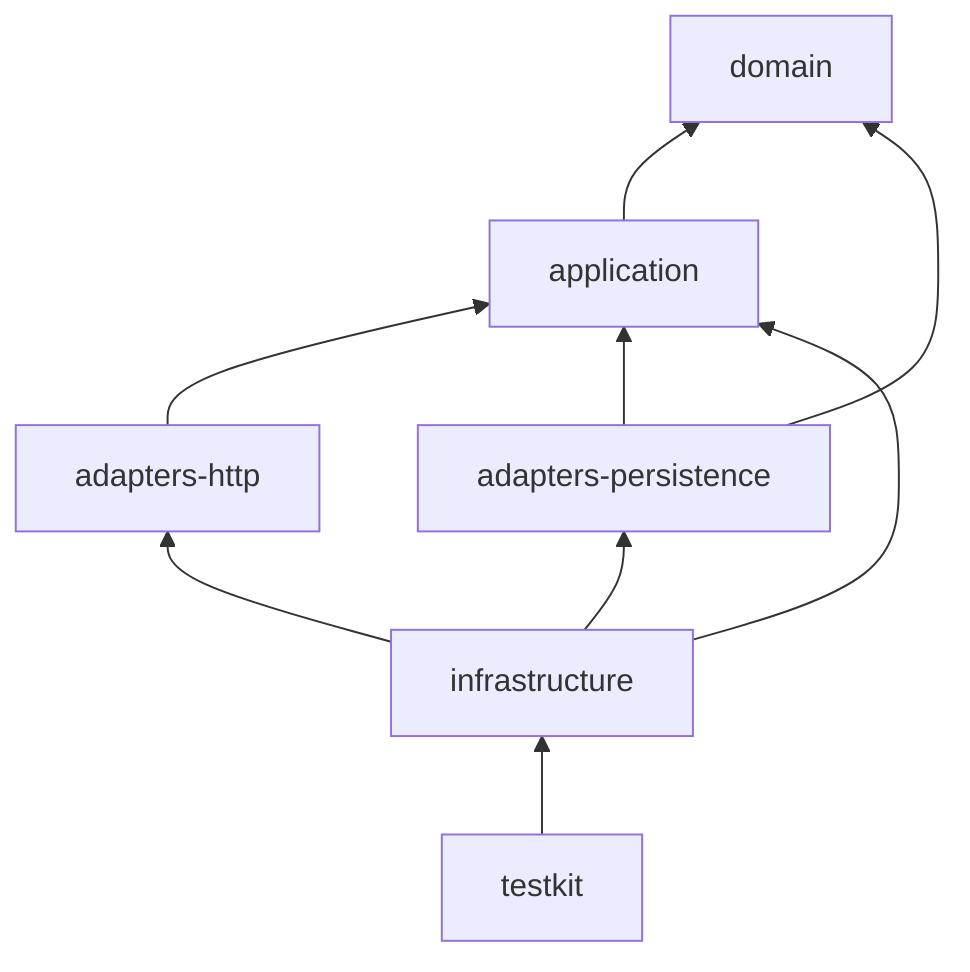
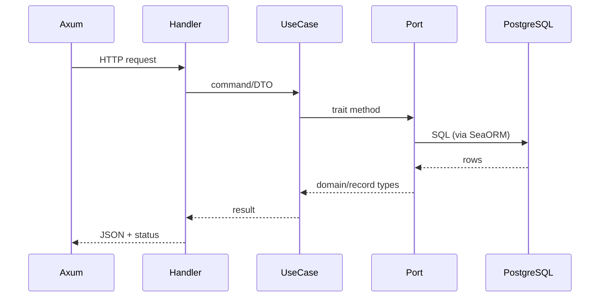

# Rust Backend Layering

Hexagonal (ports and adapters) layout for the Ficus API workspace.

## Crate Map

```
apps/api/crates/
  domain/                 # Pure business rules, no I/O
  application/            # Use cases, ports (traits)
  contracts/              # Shared types (minimal)
  adapters-http/          # Axum routes, middleware, OpenAPI
  adapters-persistence/   # SeaORM entities, repos, executors
  infrastructure/         # Composition root, config, binaries
  testkit/                # Integration test harness
```

## Dependency Direction



**Rule:** `domain` depends on nothing. `application` depends only on `domain`. Adapters implement `application::ports` traits.

## Layer Responsibilities

| Crate                  | Contains                                         | Must not contain              |
| ---------------------- | ------------------------------------------------ | ----------------------------- |
| `domain`               | `Money`, `Transfer`, `DomainError`, ledger rules | SQL, HTTP, serde on hot paths |
| `application`          | `SendTransfer`, `FeedService`, port traits, DTOs | Axum types, SeaORM entities   |
| `adapters-http`        | Handlers, middleware, error mapping              | Business logic                |
| `adapters-persistence` | Entities, migrations, `PostgresTransferExecutor` | HTTP concerns                 |
| `infrastructure`       | `AppConfig`, wiring, `main`, migrate/seed bins   | Domain invariants             |

## Request Flow



## Binaries

| Binary      | Purpose                  |
| ----------- | ------------------------ |
| `ficus-api` | HTTP server              |
| `migrate`   | Apply SeaORM migrations  |
| `seed`      | Development user seeding |

## Quality Gates

```bash
cargo fmt --check
cargo clippy --workspace --all-targets --all-features -- -D warnings
cargo nextest run --workspace
```

## Related ADRs

- [ADR-002](../ai/adr/002-hexagonal-rust-backend.md)
