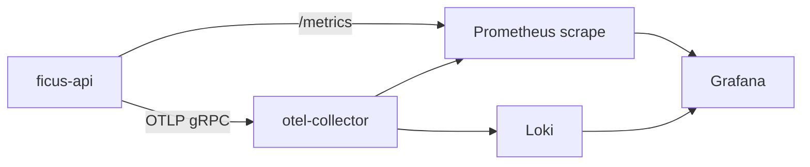

# Observability

Metrics, logs, and traces for the Ficus API and local development stack.

## Stack Overview



| Component      | Port (local)             | Purpose                                                 |
| -------------- | ------------------------ | ------------------------------------------------------- |
| API `/metrics` | 8080                     | Prometheus text exposition (request metrics, SSE gauge) |
| OTel Collector | 4317 (gRPC), 4318 (HTTP) | Receives traces/metrics from API                        |
| Prometheus     | 9090                     | Scrapes API + collector                                 |
| Loki           | 3100                     | Log aggregation                                         |
| Grafana        | 3000                     | Dashboards (admin / admin)                              |

## Starting Observability

```bash
make up-obs
# or: docker compose --profile observability up -d
```

Set in API environment:

```bash
OTEL_EXPORTER_OTLP_ENDPOINT=http://localhost:4317
OTEL_SERVICE_NAME=ficus-api
RUST_LOG=info,ficus_api=debug
```

## Instrumentation

### Tracing

- `tracing` crate with `TraceLayer` on Axum
- Request ID (`X-Request-Id`) and trace ID (`X-Trace-Id`) propagated via middleware
- Spans on transfer execution, DB retries

### Metrics

Exposed at `GET /metrics`:

| Metric                          | Type      | Description                      |
| ------------------------------- | --------- | -------------------------------- |
| `http_requests_total`           | counter   | Requests by method, path, status |
| `http_request_duration_seconds` | histogram | Latency                          |
| `sse_connections_active`        | gauge     | Open SSE streams                 |
| `transfer_executions_total`     | counter   | Transfers by status              |

### Logs

Structured JSON logs via `tracing-subscriber` in production profile. Correlation fields: `request_id`, `trace_id`, `user_id` (when authenticated).

**Never log:** passwords, JWT tokens, full `Idempotency-Key` values in production (hash or truncate if needed).

## Health Probes

| Endpoint            | Use                         |
| ------------------- | --------------------------- |
| `GET /health/live`  | Liveness — process up       |
| `GET /health/ready` | Readiness — DB connectivity |

Kubernetes / Docker health checks should use `/health/ready`.

## Dashboards

Grafana provisioning in `infra/grafana/provisioning/`. Suggested panels:

- Request rate and p95 latency by route
- Transfer success vs decline rate
- Active SSE connections
- DB pool saturation (when instrumented)

## Alerting (Production Guidance)

| Alert               | Condition                                 | Severity |
| ------------------- | ----------------------------------------- | -------- |
| API down            | `up{job="ficus-api"} == 0`                | critical |
| High error rate     | 5xx > 1% for 5m                           | warning  |
| Ready probe failing | `/health/ready` non-200                   | critical |
| SSE connection leak | `sse_connections_active` monotonic growth | warning  |

## Related

- [Runbook](./runbook.md)
- [ADR-009](../ai/adr/009-observability-stack.md)
- Skill: `.ai/skills/observability.md`
